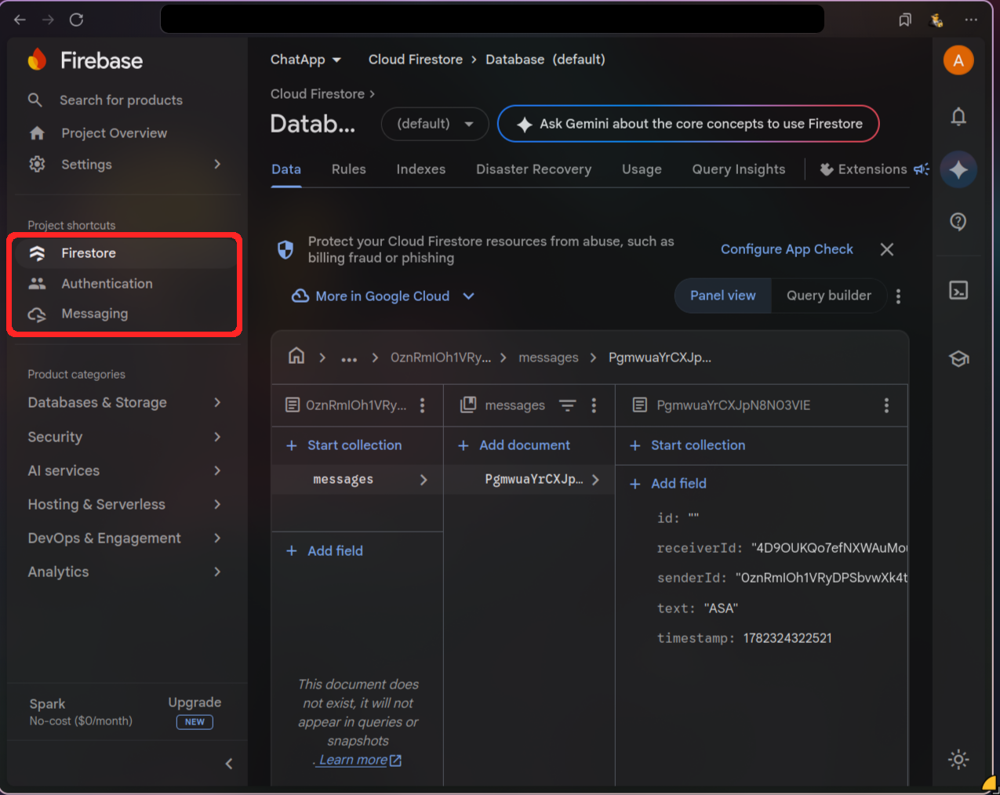
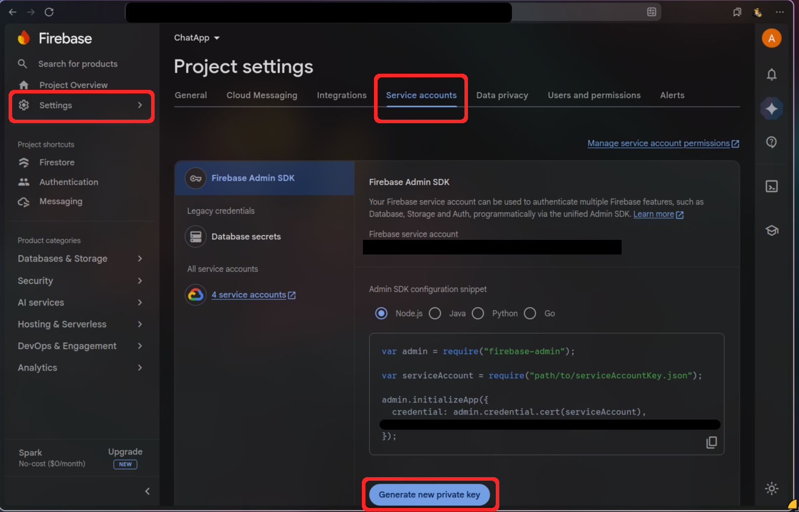
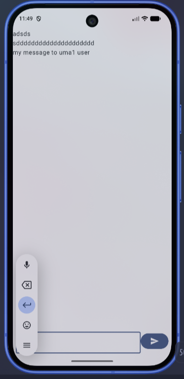
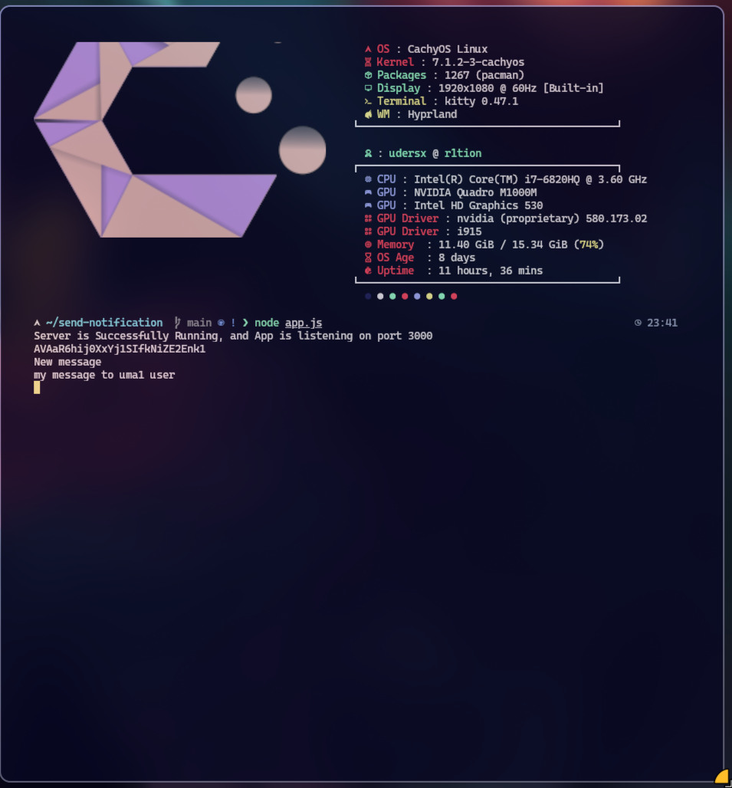
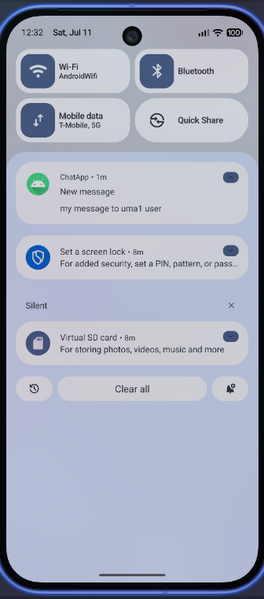

## Setup

### 1. Clone the repository

```bash
git clone https://github.com/medmoan/ChatApp-Notification-Server.git
```
### 2. Install dependencies

```bash
npm install
```
### 3. Enable these Firebase services

1. Open your Firebase project.
2. Enable these Firebase services:
   Firestore
   Authentication
   Messaging
3. See the image below.

<p align="center">
  
</p>

### 3. Download Firebase Admin SDK

<p align="center">
  
</p>

1. Open your Firebase project.
2. Go to **Project Settings**.
3. Open the **Service Accounts** tab.
4. Click **Generate new private key**.
5. Rename the downloaded file to:

```
serviceAccountKey.json
```

6. Place it in the project root.

### 4. Start the server

```bash
node app.js
```

**Test demonstrating a successful notification flow: the Android app sends a request to the backend, the backend processes it, and the notification is successfully delivered back to the Android device.**

<p align="center">
  
</p>

<p align="center">
  
</p>

<p align="center">
  
</p>

This repository contains the notification backend for ChatApp.

Both projects are connected and work together:

* ChatApp Android Client
* ChatApp Notification Server

ChatApp Repository:
https://github.com/medmoan/ChatApp
